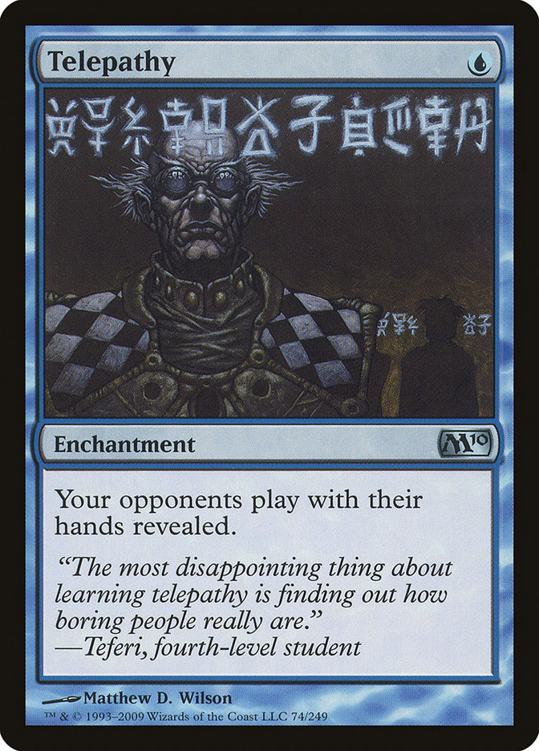

# Telepathy

**Know what a NetworkPolicy does before you merge it — no cluster required.**

Telepathy evaluates Kubernetes & Calico NetworkPolicies by running [Calico](https://github.com/projectcalico)'s **own policy engine** against a topology. In milliseconds, with no Kubernetes, no CNI, and no nodes, it tells you which pod can talk to which.

Because it reuses Felix's (Brain of Calico) real code instead of re-implementing policy semantics, the verdict matches what your cluster would actually enforce, Telepathy can even show you the **iptables/nftables chains, eBPF programs, and Windows HNS ACLs** Felix would program for the same policy.

> You changed a NetworkPolicy. Did you just lock yourself out of the database? Did you just open the attacker pod's path to it? Find out in CI, on the PR — not at 2am.

---

## What it's for

- **Test your policies** like code — assert `frontend → backend = allow`, `attacker → backend = deny`, and fail the build when an assertion breaks.
- **See the blast radius of a PR** — a base-vs-PR connectivity diff, posted as a comment, showing every flow the change *opened* or *closed*.
- **Inspect the dataplane** — render the actual iptables/nftables/eBPF/HNS rules a policy compiles to, without a cluster.

## Quick start

```bash
make build          # clones the pinned Calico tree, builds bin/telepathy
make test           # evaluate the sample topology + policy -> connectivity matrix
make verify         # run the sample assertions (the CI gate)
make diff-demo      # diff a base policy vs a PR that loosens it
```

The engine is a stdin → stdout filter: a topology Request goes in, a JSON connectivity matrix comes out.

```bash
./bin/telepathy -policy testdata/sample-policy.yaml < testdata/sample-topology.yaml
```
```json
{ "matrix": {
    "demo/frontend->demo/backend": "allow",
    "demo/attacker->demo/backend": "deny"
} }
```

## The three modes

### 1. `evaluate` (default) — the connectivity matrix
Probe every ordered pod pair at a port/protocol. A pair is `allow` only if it clears **both** the source's egress and the destination's ingress — exactly how a real packet has to pass.

### 2. `test` — assertions as a CI gate
Write expectations next to your policies and let Telepathy enforce them. Exit code is non-zero when any assertion fails.

```yaml
# telepathy.tests.yaml
assertions:
  - name: frontend may reach backend
    from: demo/frontend
    to:   demo/backend
    expect: allow
  - name: attacker must not reach backend
    from: demo/attacker
    to:   demo/backend
    expect: deny      # port/protocol optional — inherit the probe
```
```bash
telepathy test -assert telepathy.tests.yaml -policy ./policies < topology.yaml
# PASS  frontend may reach backend  (demo/frontend -> demo/backend)  expect=allow got=allow
# PASS  attacker must not reach backend  (demo/attacker -> demo/backend)  expect=deny got=deny
# 2 passed, 0 failed
```

### 3. `diff` — what did this change open or close?
Evaluate the matrix on two revisions (one per git checkout) and report only what moved:

```bash
telepathy -policy ./policies < topology.yaml > base.json   # on the base branch
telepathy -policy ./policies < topology.yaml > head.json   # on the PR branch
telepathy diff -format markdown base.json head.json
```

renders the PR comment:

> ## 🔮 Telepathy — NetworkPolicy impact
> **1 flow(s) changed** — 🟠 1 opened
>
> | Change | Flow | Before | After |
> |---|---|---|---|
> | 🟠 opened | `demo/attacker` → `demo/backend` | deny | **allow** |

`opened` (deny→allow) is a new exposure; `closed` (allow→deny) is a possible outage. Use `-format json` for machine output, or `-exit-code` to fail on any change.

## Use it in CI/CD

A GitHub Action wraps both gates. On every PR it runs your assertions **and** posts the base-vs-PR connectivity diff as a sticky comment:

```yaml
# .github/workflows/networkpolicy.yml
on: pull_request
permissions:
  contents: read
  pull-requests: write
jobs:
  telepathy:
    runs-on: ubuntu-latest
    steps:
      - uses: actions/checkout@v4
        with: { fetch-depth: 0 }   # the diff needs git history
      - uses: frozenprocess/telepathy@v1
        with:
          topology: path/to/topology.yaml
          policy: path/to/policies/         # file or directory
          assertions: path/to/telepathy.tests.yaml
```

See [`examples/github-actions.yml`](examples/github-actions.yml) for all inputs. The engine is a single static binary in a `scratch` image, so any CI that runs a container (GitLab, Tekton, Argo, Jenkins) can call it the same way:

```bash
docker run --rm -i ghcr.io/frozenprocess/telepathy:latest \
  test -assert /w/telepathy.tests.yaml -policy /w/policies < /w/topology.yaml
```

## Inspect the dataplane

The same Request renders the rules Felix would actually program — a unique window into what your policy *compiles to*:

```bash
telepathy iptables -policy p.yaml < topology.yaml   # iptables / nftables chains
telepathy bpf      -policy p.yaml < topology.yaml   # annotated eBPF policy program
telepathy hns      -policy p.yaml < topology.yaml   # Windows HNS ACL rules
```

## Input format

A Request is a topology (`endpoints`, `namespaces`) plus a probe (`port`, `protocol`); policies are layered in from stdin or via `-policy` (a file or a directory of manifests). Kubernetes `networking.k8s.io/v1` NetworkPolicies and Calico `projectcalico.org/v3` (Global)NetworkPolicy, Tier, NetworkSet, HostEndpoint, Service/ServiceAccount selectors, and more are supported. See [`testdata/`](testdata/) for a minimal end-to-end example.

```yaml
namespaces:
  - { name: demo, labels: { kubernetes.io/metadata.name: demo } }
endpoints:
  - { id: demo/frontend, namespace: demo, name: frontend, ip: 10.0.0.1, labels: { app: frontend } }
  - { id: demo/backend,  namespace: demo, name: backend,  ip: 10.0.0.2, labels: { app: backend } }
  - { id: demo/attacker, namespace: demo, name: attacker, ip: 10.0.0.3, labels: { app: attacker } }
port: 8080
protocol: tcp
```

## How it works

Telepathy is pluggable across CNIs. The vendor-neutral request/response schema lives in the small [`api`](api/) module, and each CNI's policy engine sits behind the `Provider` interface in [`provider`](provider/), selected at runtime with `-provider` (default `calico`; `telepathy version` lists the registered providers). Both drive the CNI's own code offline — no cluster.

Crucially, **each CNI engine builds as its own binary from its own Go module**, so their dependency graphs never have to reconcile (Calico and Antrea pin incompatible versions of `network-policy-api`, `controller-runtime`, etc. — linking them into one binary is impossible without version hacks). The neutral `api` JSON contract is the boundary between them:

- **`calico`** ([`provider/calico`](provider/calico/)) is linked into the main `telepathy` binary (built over `third_party/calico`): it builds a Felix `CalculationGraph` from your topology + policies, walks each ordered pair through `app-policy/checker.Evaluate` for both egress and ingress, and can render the iptables/nftables/eBPF/HNS dataplane Felix would program.
- **`antrea`** is a separate binary, `telepathy-engine-antrea` ([`engines/antrea`](engines/antrea/), built over `third_party/antrea` with Antrea's native dependency versions). The shell dispatches `-provider antrea` to it over the JSON contract (Request on stdin → Response on stdout). It drives Antrea's real `grouping.GroupEntityIndex` to resolve pod/namespace selectors, then applies Kubernetes NetworkPolicy semantics over the resolved members. A cross-process test asserts it agrees with the Calico engine flow-for-flow.

`make build` produces both binaries side by side; the shell finds the engine next to itself (override with `TELEPATHY_ANTREA_ENGINE`).

### Legal Notice

The Telepathy card image used above is unofficial Fan Content permitted under the Fan Content Policy. It is not approved or endorsed by Wizards of the Coast. Portions of the materials used are the property of Wizards of the Coast. ©Wizards of the Coast LLC.
